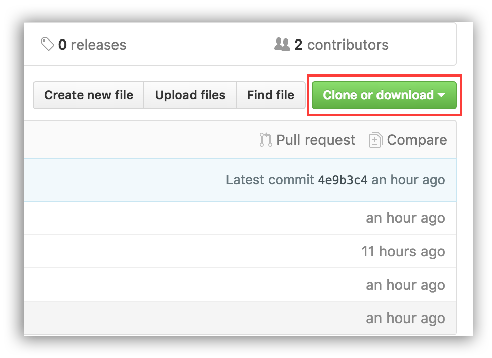
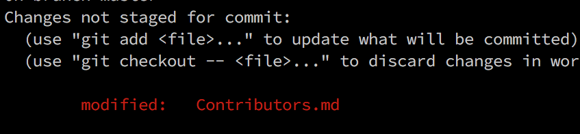
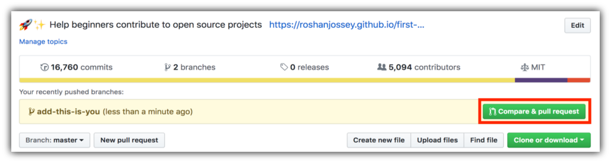

# Hacktoberfest Resources
A comprehensive list of resources and instructions to get started with Git and GitHub.

This project aims at providing guidance & simplifying the way beginners make their first contribution. If you are looking to make your first contribution, follow the steps below.

Learn to make your first Pull Request.

## Hacktoberfest 2018

###### Sign up for [Hacktoberfest2018](https://hacktoberfest.digitalocean.com/)
Support open source and earn a limited edition T-shirt. 

## Git

Setting up Git.

##### Ubuntu

```
sudo apt-get install git
```

##### Windows

[Download Git for windows](https://git-scm.com/download/win)

Follow the installer instructions to set up.

##### Check if Git is installed and working

Open the Terminal (Ubuntu) or the Command Prompt (Windows) and run
```
git
```


## Pull request

Fork this repo by clicking on the fork button on the top of this page.
This will create a copy of this repository in your account.

## Clone the repository



Now clone the forked repo to your machine. Go to your GitHub account, open the forked repo, click on the clone button and then click the *copy to clipboard* icon.

Open a terminal and run the following git command:

```
git clone "url you just copied"
```
where "url you just copied" (without the quote marks) is the url to this repository (your fork of this project). See the previous steps to obtain the url.


For example:
```
git clone https://github.com/this-is-you/first-contributions.git
```
where `this-is-you` is your GitHub username. Here you're copying the contents of the first-contributions repository in GitHub to your computer.

## Create a branch

Change to the repository directory on your computer (if you are not already there):

```
cd first-contributions
```
Now create a branch using the `git checkout` command:
```
git checkout -b <add-your-new-branch-name>
```

For example:
```
git checkout -b add-branch-name
```
(The name of the branch does not need to have the word *add* in it, but it's a reasonable thing to include because the purpose of this branch is to add your name to a list.)

## Make necessary changes and commit those changes

Now open `Contributors.md` file in a text editor, add your name to it. Don't add it at the beginning or end of the file. Put it anywhere in between. Now, save the file.




If you go to the project directory and execute the command `git status`, you'll see there are changes.


Add those changes to the branch you just created using the `git add` command:

```
git add Contributors.md
```

Now commit those changes using the `git commit` command:
```
git commit -m "Add <your-name> to Contributors list"
```
replacing `<your-name>` with your name.

## Push changes to GitHub

Push your changes using the command `git push`:
```
git push origin <add-your-branch-name>
```
replacing `<add-your-branch-name>` with the name of the branch you created earlier.

## Submit your changes for review

If you go to your repository on GitHub, you'll see a  `Compare & pull request` button. Click on that button.



Now submit the pull request.


Soon I'll be merging all your changes into the master branch of this project. You will get a notification email once the changes have been merged.

## Continue

 - [ ] Create a folder with your name.
 - [ ] Follow the same steps as mentioned above, 
 - [ ] Add code into the folder, 
 - [ ] Add the changes to the branch,
 - [ ] Commit the changes,
 - [ ] Push the changes to the branch and
 - [ ] Create a pull request

 ## Other projects

 In the same way, you can also contribute to other projects on GitHub.
 I have listed a few of the ones that aim to help beginners out with simple tasks for Hacktoberfest.

  - [Hello-world](https://github.com/Hacktoberfest-2018/Hello-world)
  - [first-contributions](https://github.com/firstcontributions/first-contributions)
  - [lingonsaft-hacktoberfest](https://github.com/lingonsaft/hacktoberfest)
  - [AliceWonderland-hacktoberfest](https://github.com/AliceWonderland/hacktoberfest)
  - [Showndarya-Hacktoberfest](https://github.com/Showndarya/Hacktoberfest)

## Progress

As you progress through contributions to open source projects, you can check your progress at [Hacktoberfest Stats](https://hacktoberfest.digitalocean.com/stats)